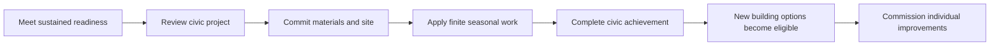

# City lifecycle — growing one continuing settlement

Architecture and implementation sequence, 7 October 2026. The baseline audit used
`origin/main` `257fb72149a9db3d05cab079a5c640175231f4c1`. **Slices A, B and C are implemented in source:** ordered continuity, paid
Small village → Large village → Town progression, separately paid improvements
and continuing civic/service staffing. Slice C began from fetched `138561d`.
The verified local 0.11.0 build remains preserved; 0.12 town delivery is recorded
in [its verification record](../Castles%20and%20Cities/sites/yenikapi_6000_bce/VERIFICATION-0.12.md).
Stages after Town and neighboring-city work remain planned. This work does not
publish a release.
The detailed implemented contract is
[LIFECYCLE.md](../Castles%20and%20Cities/sites/yenikapi_6000_bce/experience/LIFECYCLE.md).
The [shared architecture contract](../CLAUDE.md) remains authoritative.

## The player experience

**Keep one settlement and its history. Advance through a paid civic project,
then choose which newly available buildings to improve.** Completing the early
equivalent of a town hall should open possibilities across the settlement. It
should not replace the village, replenish its resources, or rebuild every home.

The proposed lifecycle is:

**Small village → Large village → Town → Large town → Small city → Large city
→ Metropolis.**

Each stage should be a satisfying place to remain. Growth adds obligations as
well as opportunities. A player can consolidate stores, repair buildings and
support household learning before choosing further expansion. There is no
automatic advance triggered solely by population, elapsed time or a camera view.

The immediate playable scope is the hypothetical Yenikapı settlement used for
the Constantinople development work. The dated Yenikapı reference and the
Constantinople circa-1200 reconstruction keep their own identities, coordinate
frames and saves. A game following one place through development is a creative
scenario; it is not evidence of uninterrupted historical occupation. Historical
period changes will need independently researched scenario bridges.

## 1. Baseline architecture audit before implementation

Paths in this section are relative to
[`Castles and Cities/sites/yenikapi_6000_bce/experience/`](../Castles%20and%20Cities/sites/yenikapi_6000_bce/experience/).

| Existing foundation | Evidence and consequence |
|---|---|
| One persistent settlement | `src/core/settlement_rules.gd::new_state`, `command`, `advance`: deterministic dictionary state with people, resources, offices, orders, projects and history. Advancement already copies and updates this state rather than starting a replacement village. |
| Paid construction with finite work | `queue` and ordered `completed` entries are the authoritative ledger. Asset initiatives supply priorities, crew limits and pauses. Use this queue for civic work too. |
| Physical continuity | `src/fabric.gd::resolve` retains untouched objects, alters identified objects, links replacements/subdivisions and retains inactive records. `yk_store_01` already has an enlargement; `yk_house_06` has a land adaptation. |
| Meaningful earlier choices | Compact housing consumes working ground; outward housing retains it but needs maintained access. Household learning, woodland depletion, asset conditions and authored responsibilities persist. |
| Local knowledge | `src/core/living_rules.gd` records household experience, discoveries and supported practice. This is useful evidence for early prerequisites; a generic technology tree is not implemented. |
| Existing town recognition | `town_conditions` and `advance` implement a reversible live milestone plus permanent `town_achieved`. This is not yet a paid civic rank. |
| Additive save extensions | `src/campaign_save.gd` accepts wrappers 1–7. Missing extensions remain inactive; adoption changes semantics explicitly. Validated temporary-file/readback/rename saving already exists. |
| Optional contacts | Two fictional aggregate neighbors exist after town achievement and the exchange project. They are not explorable neighboring cities or another development stage. |

The current town criteria are **40 residents, housing capacity equivalent to
eight six-person dwellings, two seasons of provisions, wellbeing/cooperation/
security of at least 65, seven foundation projects, and four consecutive
qualifying seasons**. Spatial equivalents satisfy the foundation requirements.
The council ground is useful but is not a mandatory legacy town requirement.
These are game balance values, not archaeological estimates.

The parent campaign already has government-building-based settlement levels in
[`SettlementRules.settlement_level`](../src/core/rules/settlements.gd) and
[`ConstructionRules`](../src/core/rules/construction.gd). Its population scale,
building effects and save model differ from this independent settlement. Reuse
the design principle, not those classes or numeric thresholds. In particular,
the parent's technique check currently occurs separately in `available_projects`;
its blocker query is not a ready-made complete lifecycle gate.

## 2. Lessons from other games

These are design references, not data, text or assets to reproduce.

| Reference | Supported mechanism | Application here |
|---|---|---|
| [Rome: Total War official manual](https://cdn.akamai.steamstatic.com/steam/apps/4760/manuals/manual_en.pdf), printed pp. 24 and 28 | Population and the appropriate government building govern advanced construction; projects cost money and take turns. | Readiness permits civic investment; completed civic investment permits further development. |
| [Feral's ROME REMASTERED building documentation](https://github.com/FeralInteractive/romeremastered/blob/main/documentation/data_file_guides/EDB.md) | Building families separate levels, capabilities, costs, duration, settlement requirements and upgrade successors. | Author the settlement ladder and individual building chains separately, with explicit dependency links. |
| [Age of Empires II advancement guide](https://www.ageofempires.com/learn-to-play/advancing-aoe2/) | Advancing at the Town Center requires resources and buildings, then opens technologies, units and buildings; some prerequisites admit alternatives. | Show an explicit investment and clear unlock preview. Accept equivalent preparation where it produces the required capability. |
| [Age of Empires IV quickstart](https://www.ageofempires.com/news/quickstart-guide-age-of-empires-iv/) and [developer roadmap](https://www.ageofempires.com/news/community-roadmap-2023/) | Landmark advancement and committed landmark choices can shape subsequent play. | Later civic branches may express lasting priorities, once their consequences are implemented and testable. |
| [Anno 1800 developer discussion of The High Life](https://www.anno-union.com/devblog-the-high-life/) | Existing residences can gain further levels; underlying residence identity influences appearance, benefits continue to apply, and growing needs/maintenance accompany development. | Upgrade in place where possible and carry obligations forward with the added capacity. |

Age of Empires ages affect an empire; making advancement local to one city is
our design decision. None of these references establishes our proposed save or
object-identity architecture. That follows from this project's continuity needs.

## 3. Separate four concepts

| Concept | Authority | What can change |
|---|---|---|
| Development stage | Authored stage definitions, selected from civic achievement | The content chapter and next civic objective. Small/large village are independent scenario stages. |
| Civic achievement | Completed civic projects, plus an explicit legacy-recognition record when adopting an older save | Unlocks further commissions. Food shortage does not erase an earned achievement. |
| Current condition and readiness | Existing population, provisions, care, cooperation, security, workforce, access and condition rules | Can improve or decline. A city can retain its institutions while struggling to operate them. |
| Historical/scenario identity | Explicit scenario/reference metadata | Changes only through a separately authored and validated scenario bridge, never from population or rank. |

Each building also has its own physical revision and functional level. A repair
can change condition without increasing either; a visual revision need not be a
functional upgrade. Keep these distinct in content and inspection.

The parent campaign's canonical IDs remain `village`, `town`, `large_town`,
`minor_city`, `large_city`, `huge_city`. Do not add `large_village` to its enums.
The new scenario can use `village_foundation` and `village_established` for its
two village stages. Both would correspond broadly to `village` in a future
reviewed adapter; that correspondence is not a save conversion.

## 4. Full lifecycle, with one stage developed at a time

The entire ladder is a design map. Only the first transition should be made
playable in the first feature release. Later rows are reserved design scope,
not active unlocks or historical building claims. Names are working labels.

| Stage / proposed scenario ID | Civic anchor and entry | New development focus | Continuing cost or constraint |
|---|---|---|---|
| Small village / `village_foundation` | Existing household community | Food, stores, shelter, shared work, care and watch | One adult has one seasonal assignment; materials and working ground are finite. |
| Large village / `village_established` | Complete a modest assembly-shelter project after demonstrating reliable local support | Further store and workroom improvements; coordinated local projects | Civic staffing competes with productive work; expansion keeps the chosen land-use costs. |
| Town / `town` | Complete a larger civic-house project after sustained town readiness | Paid material preparation and shared local provision, fitted to existing rooms; no new housing in Slice C | Two civic adults replace the earlier one, plus an optional service adult; existing access and maintenance remain; no compulsory foreign trade. |
| Large town / `large_town` | Complete a town-hall improvement supported by dependable local services | Bounded neighborhood expansion, service coverage and more specialized production | Longer service obligations and competing use of land; increased scale needs new tests. |
| Small city / `minor_city` | Complete a civic administration project with functioning neighborhood provision | District management, water/waste services and more substantial public works | Service bottlenecks and maintenance; housing redevelopment needs accommodation rules first. |
| Large city / `large_city` | Complete expanded civic administration with reliable district coordination | Multiple differentiated districts and larger infrastructure networks | Supply resilience, unequal access and greater coordination demands. |
| Metropolis / `huge_city` | Complete a metropolitan civic project after demonstrating citywide service resilience | Mature city management, restoration and specialization | Sustaining and renewing the inherited city is the challenge; regional dependencies are a later module. |

Every later service in this table needs its own real rule, cost, data reader and
acceptance scenario before it can gate an upgrade. Do not display a working
sanitation, literacy or administrative-capacity number before it exists.
Dense urban populations also need an explicit simulation/detail budget; do not
promise tens of thousands of individually animated residents using the current
small-village implementation.

Population thresholds and material prices beyond the existing town milestone
remain uncalibrated. Put them in the independent `data/balance.json` after
command-driven playtests; do not transplant the parent's campaign populations.
Keep the existing town values unchanged for legacy play. The lifecycle profile
may reference those values for its town-readiness gate without copying them.

## 5. The advancement protocol

Every transition uses the same sequence:

**Readiness** is a pure query returning named factors with current and required
values. Gates cover the previous civic achievement, supported population and
housing, food reserves, relevant social/protection stocks, foundational
capabilities, practiced knowledge where applicable, and a feasible site.
Use explicit all-of / any-of groups for authored alternatives. The evaluator
accepts a closed vocabulary of predicates; content is not an executable formula
language. Validate the combined prerequisite graph for cycles and reachability.
No transition may require something available only after that transition.

**Sustained readiness** advances once per resolved season, after existing
resource, population and societal updates. It never advances during inspection
or on loading. Reset the next transition's counter when its sustained conditions
fail. Bind the counter to a transition ID and persist its last evaluated turn so
save/resume and repeated queries cannot manufacture progress. Reset it on civic
promotion, adoption or a profile migration that changes the target. The newly
available transition receives its first evaluation in the following season;
earlier qualifying seasons cannot satisfy a later stage. Do not alter the legacy
milestone's counter.

**The quote** shows materials paid now, work still needed, eligible crew places,
likely ongoing obligations, displaced site uses and newly eligible projects.
Check reserves after immediate payment; a nominal surplus is not sufficient if
commissioning spends it. Work forecasts use actual crew and seasonal constraints,
and show conditional estimates when future staffing can change.

**Commissioning** rechecks the authoritative state, authority, readiness,
predecessor revision, queue limits and site reservations. It atomically commits
materials and adds one project to the existing queue. A stale quote cannot spend
against obsolete circumstances. The steward/God boundary remains authoritative;
view access does not grant command authority.

**During work**, paid progress survives pause, shortage, a new officeholder and
save/load. Existing labor/access constraints can stop work. Falling below the
original admission threshold does not confiscate materials or erase progress.
Cancellation uses the existing unused-material refund rule and releases staging;
completed work cannot be sold back through the cancel button. Ordinary household
food consumption remains the only food bill unless content explicitly adds a
distinct, quoted project cost.

**Completion** records the project once, changes only its explicit fabric and
grants the civic achievement. Its unlocks become available to subsequent commands;
they produce nothing retroactively in the season just resolved. A recently
impoverished settlement may complete paid civic work but will still face the
normal operating constraints and readiness gates for its next project.

An unlock grants permission to commission, not a free building, free people,
fully repaired assets, research completion or restored woodland. New civic
upkeep must use the ordinary finite allocator and begin in the following season.

## 6. Continuity and building evolution

| Item | Required carryover |
|---|---|
| Settlement, sites and roads | Stable IDs and coordinates unless an explicit paid project changes them. |
| People and households | Membership, age, knowledge, memories and actual home relationships. |
| Buildings and furnishings | Same ID for an alteration; new IDs with predecessor links for replacement/subdivision. No automatic deletion of earlier fabric. |
| Economy | Real remaining resources, depleted woodland, equipment, condition and unpaid operating needs. No stage bonus that resets them. |
| Construction | Paid materials, progress, priority, pause and responsibilities remain in the existing ledger. |
| Institutions and choices | Principles, offices, terms, authorizations, compact/outward layout and lost working land remain consequential. |
| Contacts and history | Active escrow/journeys, trust, discoveries, completed projects and journal records survive. |

For example, a further improvement to `yk_store_01` should require its current
revision, produce revision 3 from revision 2, and retain its location and relevant
furnishings. Capacity increases by the improvement's declared delta. Existing
food stays where it was; an existing condition penalty remains unless repair was
explicitly included and paid for. The civic upgrade merely makes this offer
eligible. It does not apply the store improvement itself.

The first implementation must close these observed gaps:

1. **Sequential fabric changes.** `campaign_view.snapshot` currently flattens
   every completed project's changes into one `Fabric.resolve` call. The resolver
   rejects a predecessor ID used twice in that call. Add ordered project-change
   replay with explicit expected predecessor revisions. Detect duplicate mutation
   inside one transaction while permitting a later valid revision of that object.
   Validate replay in the scene-free command/save boundary, before live state is
   accepted; rendering must not be the first place an invalid successor fails.
   Preserve existing outputs exactly for legacy saves. Do not merely remove the
   reuse guard. Record provenance by project and revision; reconstruct a revision
   history from immutable authored changes rather than saving generated meshes.
2. **Effect accounting.** Village `effect()` sums every completed project's
   effects, unlike the parent's replacement totals. For the first bounded chain,
   author explicit incremental effects with a required predecessor and validate
   that cumulative capacity equals the intended level total. Never insert a full
   next-level total as another additive bonus. A later generic active-level reader
   would require a separate compatibility change, not an unnoticed refactor.
3. **Successive site uses.** `land_rules.use_at` currently returns the first
   committed use, and `blocked` prohibits another project on a used site. Add
   allowed-successor links and a latest-completed-use projection for opted-in
   lifecycle projects. Preserve unrelated exclusivity and existing reservations.
   An upgrade is not permission to undo compact development's lost yards for free.
4. **Project versus building identity.** Current project IDs are unique and
   commissionable once. Begin with bounded authored transitions for explicit
   objects, each with a unique project ID. Repeatable templates and free placement
   later need separate definition, building-instance and commission-instance IDs.
5. **Residential redevelopment.** Per-household occupancy is currently capped
   at six; occupied removal is deliberately refused. Before increasing density,
   add per-home capacity and an atomic accommodation workflow that proves a safe
   destination for every displaced household. Exclude displacement from the first
   store/workroom upgrade slice.

When two alterations of a shared object could complete in the same season,
dependencies and predecessor revision checks must make their order explicit.
Preserve the existing ordered completion ledger; do not reconstruct order by
sorting project names or using a rendering cache.

## 7. Minimal new architecture

The following components belong inside the independent village experience.
Slices A and B now implement this seam; later stages extend the same system.

| Component | Responsibility |
|---|---|
| `data/lifecycle.json` + closed schema | Versioned stage/profile IDs, civic projects, prerequisite groups, unlock links and stage copy. Later unsupported stages are explicitly planned and cannot commission. |
| `data/balance.json` + schema extension | Sustained-season thresholds, costs, work and upkeep tuning. Existing values remain the single source where reused. |
| `src/core/lifecycle_rules.gd` | Pure stage/readiness queries, command checks, adoption and once-per-season readiness update. Returns IDs/numbers/reason codes; sentences remain data. |
| Existing `settlement_rules.gd` | Owns the public command/quote and seasonal boundary; delegates lifecycle work without adding another simulation clock. |
| Existing queue, asset and land rules | Own payment, work, assignment, reservations, cancellation and completion. New civic projects use them. |
| `src/fabric.gd` and a scene-free fabric projection | Validate/replay successive completed change sets; expose the same resolved objects to presentation and validation. |
| Existing building/growth interface | Show stage, requirements, next civic project and individual unlocks through the same authoritative quotes as world selection. |
| `tools/validate_lifecycle.py`, negative data cases, rule checks and rendered preview | Validate graph references, tuning readers, save semantics, real progression and visible continuity. Include them in the independent release builder. |

The extension should store only new memory: its version/profile identity,
adoption turn, explicitly recognized legacy achievement, next-transition ID,
readiness counter and last evaluated turn. Civic rank is derived from recognition
plus completed civic projects. Unlocks, building levels and site uses are derived
from content and the existing project ledger. Do not save duplicate stock,
population, queue or building inventories.

Pin new transition definitions to a profile/content revision so later tuning
cannot silently change an in-flight project's price, total work or predecessor.
Retain published definitions for old active profiles or write an explicit
migration. Add validation and emit/default the extension at every relevant state
creation and load boundary; all inactive readers tolerate `{}`.

Prerequisites should query local practiced capabilities. The first civic project
can be gated by supported practical work already recorded by the living rules.
An inspection can reveal a fact, but opening a panel must not generate practice
or unlock an achievement by itself. Do not add abstract research currency or
import faction-wide parent techniques merely to populate the ladder.

## 8. Existing-save adoption

Loading an older save adds only inactive `lifecycle: {}`. Existing economics,
town recognition, available legacy projects, queue and contacts keep their
semantics until the player explicitly adopts the lifecycle profile. Opening the
growth view does not adopt it. The adoption screen quotes the rules it introduces.

The first lifecycle profile requires active **assets → land → living**. Older
manual/household/contact saves must first adopt those existing extensions through
their ordinary explicit God-authorized commands, with each workforce, land and
material change explained. Lifecycle adoption refuses with a named missing
extension until that sequence is complete; it cannot silently activate those
systems or seed practice history. Once adopted, prerequisites can be earned
through ordinary work. Preserve any original paid projects through the entire
sequence. A combined adoption transaction is outside the first slice.

For adoption, preserve earned progress explicitly:

- If `town_achieved` is already true, record legacy recognition equivalent to
  town civic rank. Do not demand that the player earn the same town milestone
  again. This grants no invented physical town hall or materials; subsequent
  civic works can provide that missing physical development through paid projects.
- Otherwise start civic recognition at the foundation stage while retaining all
  completed work. Existing projects satisfy applicable prerequisite capabilities;
  do not repurchase them. Start the new sustained-readiness counter at zero,
  since the old save does not prove the new conditions held in earlier seasons.
- Existing paid legacy projects finish with their original costs, work and
  locations. Adoption cannot insert new blockers into those contracts.
- Keep legacy `phase`, `stable_seasons` and `town_achieved` behavior intact for
  existing readers and contacts. In the lifecycle interface, describe that live
  check as town support/readiness; display civic achievement separately. After
  adoption, only civic projects advance the new rank. Legacy recognition is a
  one-time adoption record, not a repeatable shortcut around civic projects.

This recognition exception must be visible and validated against the adopted
state. Do not infer physical civic buildings from it. A future town-to-large-town
transition must support a paid civic-building route for a recognized legacy town.

An active lifecycle requires a new compatible save wrapper, allocated against
the current trunk when implemented; do not reserve version 8 speculatively.
Earlier wrappers retain their meanings. Unsupported newer saves must be refused
before replacing live state, and atomic validation/readback/rename is retained.
Parent campaign, medieval creative saves and reference bookmarks stay separate.

## 9. Work on each stage in isolation

Each implemented stage gets a small package of authored content and reproducible
scenarios: entry state, enabled buildings, one next civic project, requirements,
ordinary obligations, a stressed/recovery case and exit assertions. These are
modules of one rules system, not separate applications or forked economies.

Create canonical entry fixtures by replaying public commands from a known
scenario, then saving the resulting state with provenance: profile version,
starting configuration, command transcript and expected canonical state digest.
Validate fixtures through the real save reader. A QA stage selector loads these
into temporary storage; it never edits a player's stage or production save.

For each transition retain at least these cases:

| Fixture | What it proves |
|---|---|
| Compact / outward | Earlier spatial decisions remain distinguishable after promotion. |
| Ready / one requirement missing | Each gate has a useful explanation and can be satisfied without later-stage content. |
| Civic work partly complete | Pausing, cancellation, office succession and save/resume preserve paid progress. |
| Immediately after promotion | The next transition starts at zero sustained seasons, including after save/resume. |
| Healthy / stressed at the same civic rank | Economic decline affects operation without erasing development. |
| Existing town adopted | Recognition preserves prior achievement without inventing a town hall or rerunning the tutorial. |
| Legacy save without assets/land/living | Missing dependencies explain the adoption route; explicit extension adoption retains contracts and makes the first civic gate attainable. |
| Continued from the preceding stage | The isolated fixture and the end-to-end path reach equivalent state. |

Later planned stages may have design briefs and mock presentation fixtures, but
must not be presented as reachable, validated gameplay until their prerequisites
and complete continuation path exist.

## 10. Delivery sequence and acceptance

| Slice | Concrete deliverable | Done when |
|---|---|---|
| A — continuity foundation | Ordered revision replay, correct incremental effects and explicit site successors, with no new city tier yet | The same store can pass through two paid alterations; old save/geometry outputs remain unchanged; conflicting revisions and site double-booking fail. |
| B — small to large village | Lifecycle data/rules, explicit adoption, assembly-shelter commission and two individually paid follow-on store/workroom improvements | Both land strategies reach it through normal commands, survive a shortage and continue after save/load. No residential displacement or neighbor requirement. |
| C — large village to town | Paid civic-house transition linked to sustained town support, two separate operational investments and the legacy-recognition route | Both strategies sustain town; finite civic/service duty affects actual preparation and spoilage; saves, contacts, incidents and prior fabric survive. |
| D — large town | More household sites and local service coverage, with scale/performance evidence | Entry, expansion, upkeep and recovery all work from the preceding live stage. |
| E — city stages | One stage at a time: district services, residential accommodation, then larger infrastructure | Each stage has operational systems, an independent entry fixture and a tested end-to-end continuation. |
| F — neighboring cities | Reusable settlement identity, connections and regional interaction | Local progression is coherent; regional exchanges preserve finite resources and separate city ownership. |

For slice B, prototype prices, work and readiness duration belong in balance
data and are reviewed through two ordinary playthroughs before acceptance. The
requirements must be attainable with starting-stage content. Reserve policy,
care, food and watch must still compete with civic staffing. Unlock only the two
implemented improvements; the distant ladder may be visible as planned scope.

Required implementation checks include pure preview/quote behavior; rejected
command immutability; exact save/resume before commissioning, mid-work and after
completion; once-only spending/effects/events; post-payment reserve checks;
no duplicate adult assignment; stale revision/site rejection; an acyclic,
reachable combined prerequisite graph; and unchanged legacy replay. Also check
active contacts/escrow and incidents if those extensions accompany adoption.

Rendered acceptance must show the same plot/building before work, during work,
after civic completion and after its individual upgrade; preserve furnishings,
doors, routes and matching drawing/picking. Inspect the requirements, costs,
locked/eligible offers, lineage and carryover at the 1280×800 layout. Idle frames,
preview rotation and report replay must leave authoritative state unchanged.
Images stay outside the repository. Compare unchanged procedural model exports
and measure refresh/transition latency; synchronous fabric rebuilding is an
existing performance constraint, not solved by this document.

Run independent schema/negative cases and retained village suites, then lifecycle
checks and actual rendered progression. Release validation still includes parent
`python3 tools/validate_data.py`, Godot import, the complete regression suite and
actual map planning/marching/arrival/maximum-zoom inspection. Check stderr as well
as exit codes. Repeat applicable checks against the exact packaged app before a
release; a planning document does not satisfy those future gates.

## 11. Neighboring-city boundary

Retain existing optional contacts and their saves. No first-stage civic gate
requires trade, conquest, tribute or an external city. This allows the local
lifecycle to be developed and balanced independently as requested.

Later define a pure, versioned settlement-development report containing source
scenario/settlement identity, civic achievements, population/capacity summaries,
public infrastructure and explicit fabric lineage. A regional adapter can use
reviewed mappings without reading scene nodes or merging independent saves.
It must respect visibility rather than exposing hidden foreign state. Regional
transactions need finite escrow, ownership and once-only completion; any combat
continues through the parent `BattleResolver` seam.

**Slices A, B and C are implemented in source.** Wrapper 8 retains the published
base lifecycle profile. Explicit `lifecycle_town_begin` adds a separately pinned
town contract without repricing earlier paid work. The civic house alters the
assembly shelter; two optional paid facilities adapt the existing small store and
care shelter. Town readiness reads the authoritative legacy support factors and
uses the existing transition-bound counter. Legacy recognized towns pay for
missing civic fabric without losing rank or receiving free promotion benefits.

Town operation requires finite civic staffing and maintained stores. Separate
preparation and spoilage readers consume real materials/places and service labor.
Compact and outward 100-season public-command recipes retain their earlier space
costs; stress and recovery preserve achievement. The same site/dock/planning room
manages every project. Slice D and later rows remain development plans, not
playable city systems. No additional residential density is part of Slice C.
